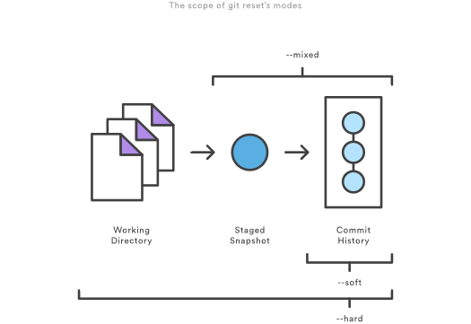
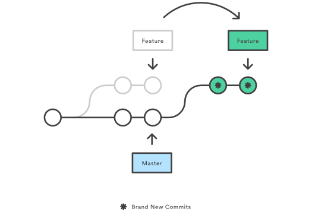

> Following sections gives idea about frequently used actions on Git

### Saving  changes
1. Add files to staging
```
git add .           # adds all modified files in current directory and sub-directory
git add <file-name> # adds file
git add <folder>    # add folder and its contents 
git add -p          # review changes and add files interactively
```
2. Commit changes with the message
```
git commit -m "<your-commit-message"  # commits all staged changes
git commit                            # open editor(notepad++) for typing commit message
```

### Stashing your work
The `git stash` command takes your uncommitted changes (both staged and unstaged), saves them away for later use, and then reverts them from your working copy
```
git stash                        # stashes staged changes
git stash save "<stash-message>"
git stash -u                     # stash staged files including untracked files
git stash list                   # list stashed changes
git stash show stash@{0}         # show stash details
git stash apply stash@{0}        # apply stash changes to working directory
```

### Inspecting a repository

- `git status` - List which files are staged, unstaged, and untracked
> The git status command displays the state of the working directory and the staging area. It lets you see which changes have been staged, which haven’t, and which files aren’t being tracked by Git.

- `git log` - Displays committed snapshots
> The git log command displays committed snapshots. It lets you list the project history, filter it, and search for specific changes.

-  `git log -n <limit>`
> Display the entire commit history using the default formatting. If the output takes up more than one screen, you can use Space to scroll and q to exit

- `git log --oneline`
> Condense each commit to a single line. This is useful for getting a high-level overview of the project history

### Undoing a committed snapshot
There are technically several different strategies to 'undo' a commit. The following examples will assume we have a commit history that looks like:
```
git log --oneline
872fa7e Try something crazy
a1e8fb5 Make some important changes to hello.txt
435b61d Create hello.txt
9773e52 Initial import
```
We will focus on undoing the 872fa7e Try something crazy commit. Maybe things got a little too crazy.


- `git reset --hard a1e8fb5 ` 

   Commit history is reset to that specified commit. Examining the commit history with `git log` will now look like
```
  git log --oneline
  a1e8fb5 Make some important changes to hello.txt
  435b61d Create hello.txt
  9773e52 Initial import
```

- `git commit --amend`

   In some cases though, you might not need to remove or reset the last commit. Maybe it was just made prematurely. In this case you can amend the most recent commit. Once you have made more changes in the working directory and staged them for commit by using `git add`, you can execute `git commit --amend`. This will have Git open the configured system editor and let you modify the last commit message. The new changes will be added to the amended commit.

### Undoing uncommitted changes

Before changes are committed to the repository history, they live in the staging index and the working directory. You may need to undo changes within these two areas. The staging index and working directory are internal Git state management mechanisms. For more detailed information on how these two mechanisms operate, visit the [`git reset`](https://www.atlassian.com/git/tutorials/resetting-checking-out-and-reverting) page which explores them in depth
> The scope of `git reset` modes


- `git reset --soft` - The staged snapshot and working directory are not altered in any way.
- `git reset --mixed`- The staged snapshot is updated to match the specified commit, but the working directory is not affected. This is the default option.
- `git reset --hard` - The staged snapshot and the working directory are both updated to match the specified commit.

>The table below sums up the most common use cases for all of these commands

Command | Scope | Common use cases
--------|-------|-----------------
`git reset` | Commit-level | Discard commits in a private branch or throw away uncommited changes
`git reset` | File-level |Unstage a file
`git checkout` | Commit-level | Switch between branches or inspect old snapshots
`git checkout` | File-level | Discard changes in the working directory
`git revert` | Commit-level | Undo commits in a public branch
`git revert` | File-level | (N/A)

- `git clean` - command operates on untracked files. Untracked files are files that have been created within your repo's working directory but have not yet been added to the repository's tracking index using the git add command

- `git clean -n` - The -n option will perform a "dry run" of `git clean`. This will show you which files are going to be removed without actually removing them. It is a best practice to always first perform a dry run of `git clean`

### What is `git rebase`?
Rebasing is the process of moving or combining a sequence of commits to a new base commit. Rebasing is most useful and easily visualized in the context of a feature branching workflow. The general process can be visualized as the following:


From a content perspective, rebasing is changing the base of your branch from one commit to another making it appear as if you'd created your branch from a different commit. Internally, Git accomplishes this by creating new commits and applying them to the specified base.

>This automatically rebases the current branch onto \<base\>, which can be any kind of commit reference (for example an ID, a branch name, a tag, or a relative reference to HEAD).

```
   git checkout feature
   git rebase
```
#### Usage
The primary reason for rebasing is to maintain a linear project history. For example, consider a situation where the master branch has progressed since you started working on a feature branch. You want to get the latest updates to the master branch in your feature branch, but you want to keep your branch's history clean so it appears as if you've been working off the latest master branch. This gives the later benefit of a clean merge of your feature branch back into the master branch. Why do we want to maintain a "clean history"? The benefits of having a clean history become tangible when performing Git operations to investigate the introduction of a regression. A more real-world scenario would be:
1. A bug is identified in the master branch. A feature that was working successfully is now broken.
2. A developer examines the history of the master branch using git log because of the "clean history" the developer is quickly able to reason about the history of the project.
3. The developer can not identify when the bug was introduced using `git log` so the developer executes a `git bisect`.
4. Because the git history is clean, `git bisect` has a refined set of commits to compare when looking for the regression. The developer quickly finds the commit that introduced the bug and is able to act accordingly.