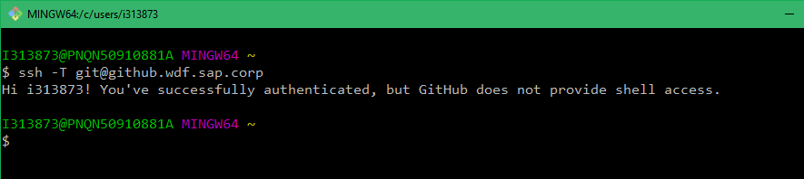

# Git Setup on Windows Machine

Follow below instructions to setup Git on your Windows machine.

## Prerequisites

- Follow [Git Installation steps](https://github.wdf.sap.corp/OmniChannelBanking/git-demo/wiki/Git-Installation-on-Windows) - **Make sure everyone has same configuration given on the link** ❗️

- Install WinMerge for merging changes in case of mergconflict. **_\\\uapune1.sybase.com\OCB_Softwares\Sachin\Git_** or http://winmerge.org/


## Git Configuration

Once you have installed Git, you will have to adapt the .gitconfig file to properly integrate with SAPs Git landscape:

1. Open a terminal
2. change into your user's directory e.g. C:\Users\i313873\
3. try to open `.gitconfig`
     * If the file does not exist, create a file '.gitconfig'
4. Paste the following into the .gitconfig file:
```
[user]
    name = <Your Real Name, e.g. Sachin Bhosale>
    email = <your sap email address, e.g. s.bhosale@sap.com>

[color]
    ui = true
    status = auto
    branch = auto
 
[core]
    autocrlf = true
    filemode = false

[http]
    proxy = http://proxy.wdf.sap.corp:8080
    sslVerify = false

[https]
    proxy = http://proxy.wdf.sap.corp:8080

[mergetool]
    prompt = false
    keepBackup = false
    keepTemporaries = false
	
[merge]
    tool = winmerge

[mergetool "winmerge"]
    name = WinMerge
    trustExitCode = true
    cmd = "/c/Program\\ Files\\ \\(x86\\)/WinMerge/WinMergeU.exe" -u -e -dl \"Local\" -dr \"Remote\" $LOCAL $REMOTE $MERGED

[diff]
    tool = winmerge

[difftool "winmerge"]
    name = WinMerge
    trustExitCode = true
    cmd = "/c/Program\\ Files\\ \\(x86\\)/WinMerge/WinMergeU.exe" -u -e $LOCAL $REMOTE
```
5. Save and close the file.


## Generate SSH key

- Search `git bash` in `Windows Start` and open it

- Run the command `ssh-keygen -t rsa -C "your_email@sap.com"`. Press enter on prompt. It will save below 2 files in `/c/users/i313873/.ssh` folder. (Folder will change according to your UserID)
    * `id_rsa` - private key
    * `id_rsa.pub` - public key

- Go to [https://github.wdf.sap.corp](https://github.wdf.sap.corp) and follow the instructions on [Adding a new SSH key to your GitHub account](https://help.github.com/articles/adding-a-new-ssh-key-to-your-github-account/) 

- After adding SSH key, open `Git Bash` and run below command to see if authentication is successful

```
    I313873@PNQN50910881A MINGW64 ~
    $ ssh -T git@github.wdf.sap.corp
    Hi i313873! You've successfully authenticated, but GitHub does not provide shell access.
```