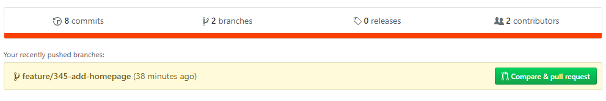
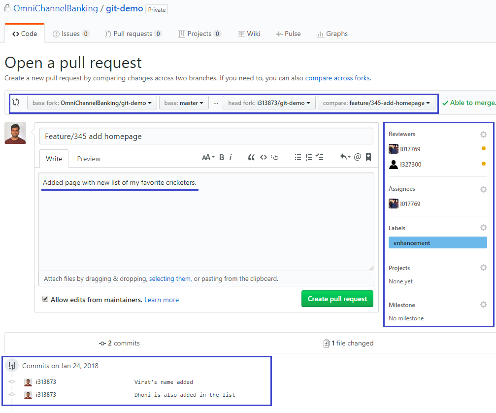
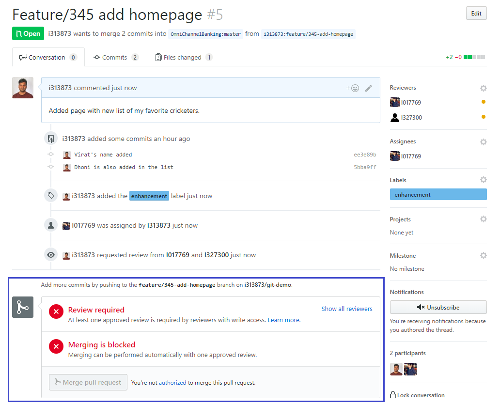
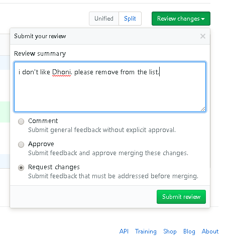
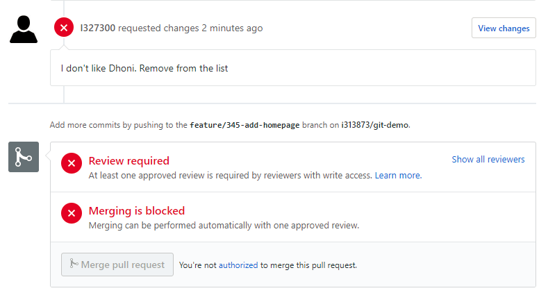
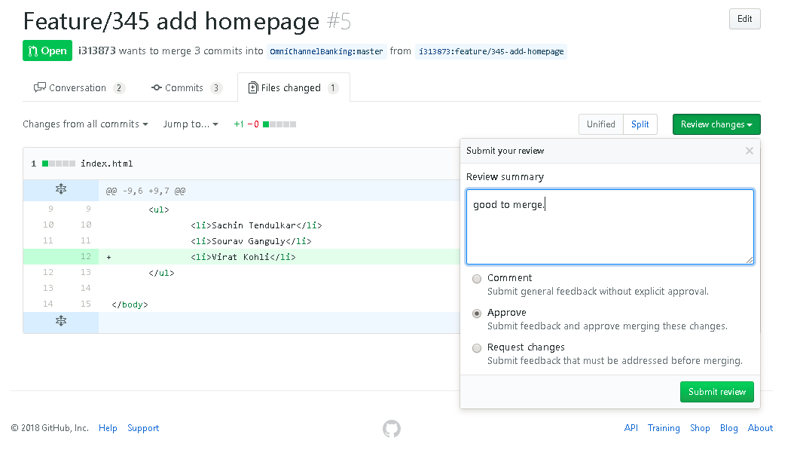
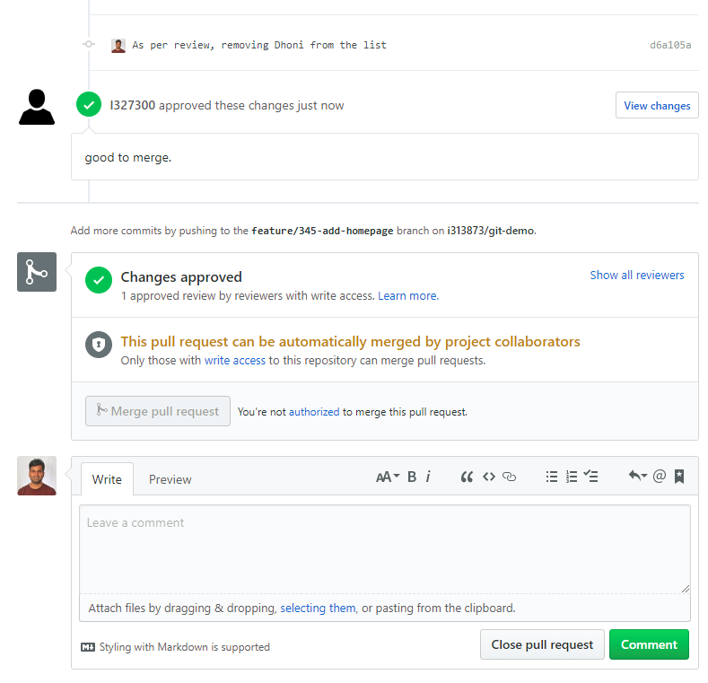
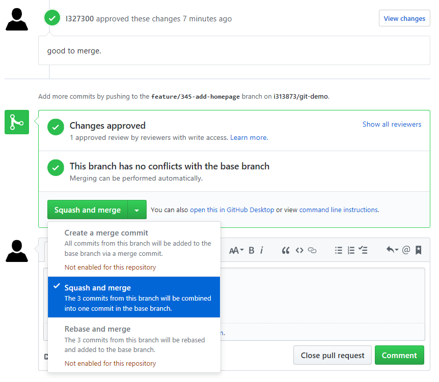
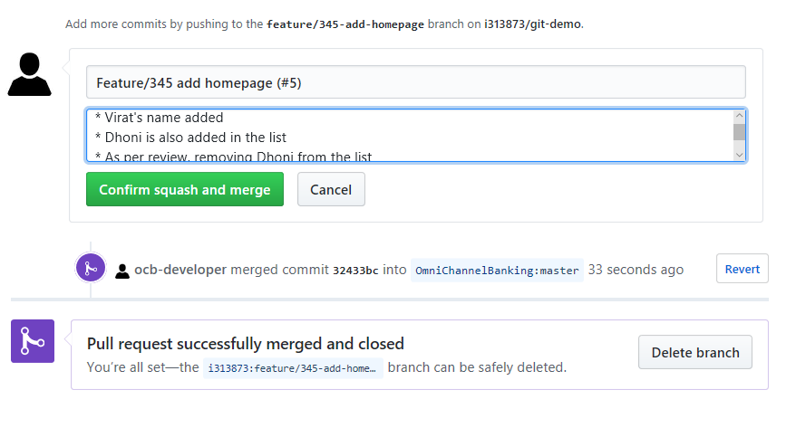

## Developement Workflow
1. Developer identifies a feature or defect to be developed.
    - __feature-345__ is the feature to be developed which requires home page to be developed

2. Get latest changes from upstream branch
    ```bash
    git checkout master
    # Get the changes from upstream `master` branch and merge into local master branch
    git pull upstream master
    ```
3. Create a branch for the feature
    ```bash
    # go to master branch and create a new branch
    c:\Projects\github-sap\i313873\git-demo>git checkout master
    Switched to branch 'master'
    Your branch is up to date with 'origin/master'.

    # Create and checkout the branch
    c:\Projects\github-sap\i313873\git-demo> git checkout -b feature/345-add-homepage
    Switched to a new branch 'feature/345-add-homepage'
    ```

4. Make changes for the feature and commit the changes
   ```bash
    c:\Projects\github-sap\i313873\git-demo> git status
    On branch feature/345-add-homepage
    Changes not staged for commit:
      (use "git add <file>..." to update what will be committed)
      (use "git checkout -- <file>..." to discard changes in working directory)

            modified:   index.html

    no changes added to commit (use "git add" and/or "git commit -a")

    # Make some change
    c:\Projects\github-sap\i313873\git-demo>git commit -am "Virat's name added"
    [feature/345-add-homepage ee3e89b] Virat's name added
     1 file changed, 1 insertion(+)
    
    # Add another change
    c:\Projects\github-sap\i313873\git-demo>git commit -am "Dhoni is also added in the list"
    [feature/345-add-homepage 5bba9ff] Dhoni is also added in the list
     1 file changed, 1 insertion(+)

    # Check git log to see the recent commmits made
    c:\Projects\github-sap\i313873\git-demo>git log -n 5
    commit 5bba9ff1c937fb7bd78da584defcb8c8f203c09a (HEAD -> feature/345-add-homepage)
    Author: Sachin Bhosale <s.bhosale@sap.com>
    Date:   Wed Jan 24 15:47:54 2018 +0530

        Dhoni is also added in the list

    commit ee3e89b099b7ed7f1015e6310686833799edf71e
    Author: Sachin Bhosale <s.bhosale@sap.com>
    Date:   Wed Jan 24 15:45:02 2018 +0530

        Virat's name added

    commit dcb6dffcb7c5c403225a1256472361d3fe93c191 (upstream/master, origin/master, origin/HEAD, master)
    Author: Sachin Bhosale <s.bhosale@sap.com>
    Date:   Wed Jan 24 14:27:11 2018 +0530

        List of cricketers added (#4)

        Initial commit for Git Forking tutorial

   ```

5. Once all changes for the feature and unit testing is done on a feature branch, you can push the branch to your forked repository
    ```bash
    c:\Projects\github-sap\i313873\git-demo> git push origin feature/345-add-homepage
    Counting objects: 6, done.
    Delta compression using up to 4 threads.
    Compressing objects: 100% (6/6), done.
    Writing objects: 100% (6/6), 634 bytes | 211.00 KiB/s, done.
    Total 6 (delta 2), reused 0 (delta 0)
    remote: Resolving deltas: 100% (2/2), completed with 1 local object.
    To https://github.wdf.sap.corp/i313873/git-demo.git
     * [new branch]      feature/345-add-homepage -> feature/345-add-homepage
    ```
6. Go to your forked repository webpage and create a pull request as shown below
    
     

           


### GitHub Review Process
As of GitHub 2.8 GitHub comes with its own built-in review process. In the following this is explained.

>To start a review on a pull request...

>1. Open the Files changes tab in GitHub,
>2. Leave comments on the code,
>3. Select Start a review when finished. You can continue to leave multiple comments on the code.

>Once finished you can Review changes, select an option, and finally Submit review. Your options are as follows:

>* **Comment** - Comments do not require a review!
>* **Approve** - Approves the pull request, equivalent to a Gerrit +1
>* **Request** changes - Indicates that something needs to be resolved before merging to a Gerrit -1


7. Once developer creates a pull request, it cannot be merged until 1 approved review is there
     


8. Reviewer see the file changes and request a change as part of the review comment. You will get a email notification.
     

     


9. Developer works on the review comments and submits the changes to same branch.
    ```
    c:\Projects\github-sap\i313873\git-demo>git commit -am "As per review, removing Dhoni from the list"
    [feature/345-add-homepage d6a105a] As per review, removing Dhoni from the list
     1 file changed, 1 deletion(-)

    c:\Projects\github-sap\i313873\git-demo>git push origin feature/345-add-homepage
    Counting objects: 3, done.
    Delta compression using up to 4 threads.
    Compressing objects: 100% (3/3), done.
    Writing objects: 100% (3/3), 331 bytes | 165.00 KiB/s, done.
    Total 3 (delta 1), reused 0 (delta 0)
    remote: Resolving deltas: 100% (1/1), completed with 1 local object.
    To https://github.wdf.sap.corp/i313873/git-demo.git
       5bba9ff..d6a105a  feature/345-add-homepage -> feature/345-add-homepage
    ```


10. Reviewer verifies the changes and approves Pull Request changes

     

     

11. Project collaborator merges the changes to repository and Pull Request gets closed

     

     
